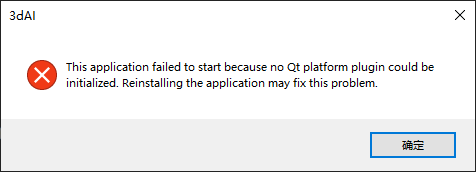
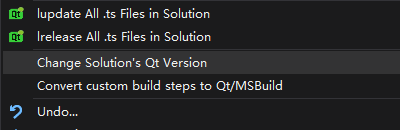

# Qt Coding Tips

<https://www.jianshu.com/p/304c9e6de4d2>

********************************

很少使用 Qt，由于 meshlab 使用了 Qt，只好花点时间熟悉一下。

## 0. Qt 应用程序的部署问题

Qt 应用程序的 Release 版本被编译好后，如果部署环境中未安装相应的动态链接库，
点击运行后会出现如下错误：



解决的办法是当前目录下运行 D:\Qt\Qt5.14.2\5.14.2\msvc2017_64\bin 中的 windeployqt.exe:
```shell
D:\Qt\Qt5.14.2\5.14.2\msvc2017_64\bin\windeployqt.exe 3dAI.exe
```
运行完成后，目标.exe同级目录中就会出现其依赖库了，
相关的plugins和platform文件夹与动态库都会拷贝在该目录下。

## 1. QPainter

entrance level: <https://blog.csdn.net/myuml/article/details/4271540>

senior level: [Qt开发技术：Qt绘图系统（二）QPainter详解](https://blog.csdn.net/qq21497936/article/details/105506028)

---

#include <qpainter.h>

QPainter类有点类似于 MFC 中的 CDC 类。

对要绘制的部件需要重载虚拟函数 paintEvent

```cpp
protected:
    virtual void paintEvent( QPaintEvent * pPaintEvent );
```

在 paintEvent 中进行绘制：
```cpp
{
    QPainter p;

    p.begin(this);

    ......

    p.end();
}
```

QPainter 常用的成员函数和 MFC 中常用的成员函数非常类似, 例如:

drawRect/fillRect/drawLine/drawText/drawPoint/drawPoints/moveTo/lineTo

drawLineSegments/drawPolyline/drawPolygon/drawEllipse/drawArc/drawPixmap...

而且类似 MFC，QPainter 可以设置画笔、画刷。例如：

```cpp
QBrush brush( QColor("white") );

p.setBrush(brush);  // 在begin之后set

QPen pen( QColor("black"), 2, Qt::SolidLine );

p.setPen(pen);
```
 

创建一个填充画刷:

```cpp
QBrush brush;

QPixmap pixmap(...);

brush.setPixma( pixmap );
```

## 2 paintEvent

[QT关键问题解决之paintEvent理解](https://blog.csdn.net/u012151242/article/details/78947024)

--------------

## 3 [QSplitter](QSplitter.md)

## 4 Change Solution's Qt Version

Right click the name of the solution and ...



## 5 Is there an event loop for Qt applications?

<https://doc.qt.io/qt-5/qcoreapplication.html#details>

-------------------------------------------------------

The QCoreApplication class provides an event loop for Qt applications without UI. 
This class is used by non-GUI applications to provide their event loop. For non-GUI 
application that uses Qt, there should be exactly one QCoreApplication object. For 
GUI applications, see QGuiApplication. For applications that use the Qt Widgets 
module, see QApplication.

QCoreApplication contains the main event loop, where all events from the operating 
system (e.g., timer and network events) and other sources are processed and 
dispatched. It also handles the application's initialization and finalization, as 
well as system-wide and application-wide settings.

### 5.1 The Event Loop and Event Handling

The event loop is started with a call to exec(). Long-running operations can call 
processEvents() to keep the application responsive.

In general, we recommend that you create a QCoreApplication, QGuiApplication or a 
QApplication object in your main() function as early as possible. **exec( ) will not 
return until the event loop exits**; e.g., when quit() is called.

Several static convenience functions are also provided. The QCoreApplication object 
is available from instance(). Events can be sent with sendEvent() or posted to an 
event queue with postEvent(). Pending events can be removed with removePostedEvents() 
or dispatched with sendPostedEvents().

## 6 [Qt Resource Editor](resourceEditor.md)


