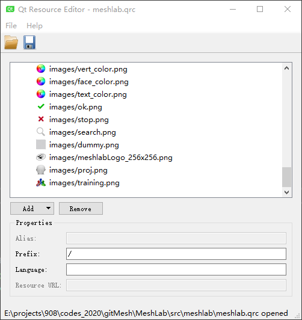

# Qt Resource Editor

<https://blog.csdn.net/jirryzhang/article/details/60137795>

***********************

In solution explorer, double click meshlab.qrc will load the 
Qt resource editor. All your resource should be added here for later use.

Qt的qrc(资源文件)文件默认是用qt资源编辑器打开的，这个编辑器程序是qrceditor.exe。当VS无法用这个编辑器查看qrc文件时，在vs工程解决方案中右键单击qrc文件,选择(打开方式...),在弹出的界面中点击(添加...),找到Qt-VS-Add-in插件的安装目录，假设($Qt4VSAddin)是你安装的Qt vs插件的位置，在弹出的添加打开方式对话框中填入

程序名称:($Qt4VSAddin)\qrceditor.exe
友好名称:Qt Resource Editor(可随意填)
然后点击确定,再点击"设为默认值"即可.

这样就可以用qt自己的资源编辑器编辑qrc文件了。
