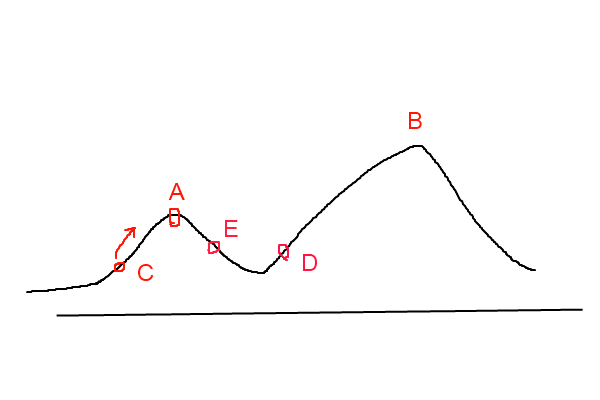

# Simulated Annealing

<https://www.cnblogs.com/heaad/archive/2010/12/20/1911614.html>

****************************

## 1 Hill Climbing


介绍模拟退火前，先介绍爬山算法。爬山算法是一种简单的贪心搜索算法，
该算法每次从当前解的临近解空间中选择一个最优解作为当前解，直到达到一个局部最优解。

爬山算法实现很简单，其主要缺点是会陷入局部最优解，而不一定能搜索到全局最优解。
如图所示：假设C点为当前解，爬山算法搜索到A点这个局部最优解就会停止搜索，
因为在A点无论向那个方向小幅度移动都不能得到更优的解。



## 2 Simulated Annealing

爬山法是完完全全的贪心法，每次都鼠目寸光的选择一个当前最优解，因此只能搜索到局部的最优值。
模拟退火其实也是一种贪心算法，但是它的搜索过程引入了随机因素。
模拟退火算法以一定的概率来接受一个比当前解要差的解，因此有可能会跳出这个局部的最优解，
达到全局的最优解。以上图为例，模拟退火算法在搜索到局部最优解A后，
会以一定的概率接受到E的移动。也许经过几次这样的不是局部最优的移动后会到达D点，
于是就跳出了局部最大值A。

         模拟退火算法描述：

         若J( Y(i+1) )>= J( Y(i) )  (即移动后得到更优解)，则总是接受该移动

         若J( Y(i+1) )< J( Y(i) )  (即移动后的解比当前解要差)，则以一定的概率接受移动，
         而且这个概率随着时间推移逐渐降低（逐渐降低才能趋向稳定）

这里的“一定的概率”的计算参考了金属冶炼的退火过程，这也是模拟退火算法名称的由来。

根据热力学的原理，在温度为T时，出现能量差为dE的降温的概率为P(dE)，表示为：

　　　　P(dE) = exp( dE/(kT) )

其中k是一个常数，exp表示自然指数，且dE<0。这条公式说白了就是：温度越高，
出现一次能量差为dE的降温的概率就越大；温度越低，则出现降温的概率就越小。
又由于dE总是小于0（否则就不叫退火了），因此dE/kT < 0 ，所以P(dE)的函数取值范围是(0,1) 。

随着温度T的降低，P(dE)会逐渐降低。

我们将一次向较差解的移动看做一次温度跳变过程，我们以概率P(dE)来接受这样的移动。

关于爬山算法与模拟退火，有一个有趣的比喻：

爬山算法：兔子朝着比现在高的地方跳去。它找到了不远处的最高山峰。
但是这座山不一定是珠穆朗玛峰。这就是爬山算法，它不能保证局部最优值就是全局最优值。

模拟退火：兔子喝醉了。它随机地跳了很长时间。这期间，它可能走向高处，也可能踏入平地。
但是，它渐渐清醒了并朝最高方向跳去。这就是模拟退火。

下面给出模拟退火的伪代码表示。
```cpp
/** J(y)：在状态y时的评价函数值
* Y(i)：表示当前状态
* Y(i+1)：表示新的状态
* r： 用于控制降温的快慢
* T： 系统的温度，系统初始应该要处于一个高温的状态
* T_min ：温度的下限，若温度T达到T_min，则停止搜索
*/

    while( T > T_min )
    {
        dE = J( Y(i+1) ) - J( Y(i) ) ;
 　　    if ( dE >=0 ) //表达移动后得到更优解，则总是接受移动
            Y(i+1) = Y(i) ; //接受从Y(i)到Y(i+1)的移动
        else
        { // 函数exp( dE/T )的取值范围是(0,1) ，dE/T越大，则exp( dE/T )也
            if ( exp( dE/T ) > random( 0 , 1 ) )
                Y(i+1) = Y(i) ; // 接受从Y(i)到Y(i+1)的移动
        }

        T = r * T ; //降温退火 ，0<r<1 。r越大，降温越慢；r越小，降温越快
    /*
 　　* 若r过大，则搜索到全局最优解的可能会较高，但搜索的过程也就较长。
    * 若r过小，则搜索的过程会很快，但最终可能会达到一个局部最优值　　
    */

        i++;
    }
```

