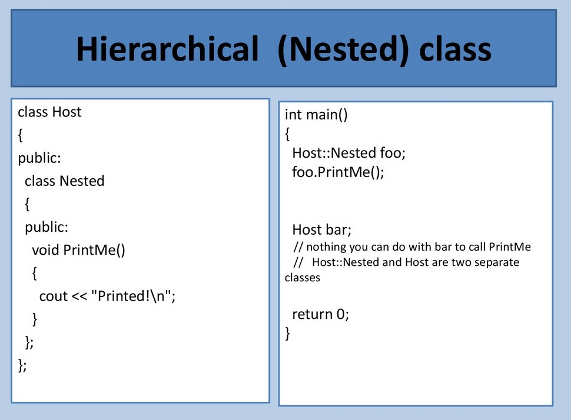

# Nested Classes

<https://en.cppreference.com/w/cpp/language/nested_types>

[模板类与模板类嵌套](https://blog.csdn.net/std_modcity/article/details/86292941)

******************

A declaration of a class/struct or union may appear within another class. 
Such declaration declares a nested class.



## Explanation
The name of the nested class exists in the scope of the enclosing class, 
and name lookup from a member function of a nested class visits the scope of 
the enclosing class after examining the scope of the nested class. 
Like any member of its enclosing class, the nested class has access to all names 
(private, protected, etc) to which the enclosing class has access, 
but it is otherwise independent and has no special access to the this pointer 
of the enclosing class.

> Declarations in a nested class can use only type names, static members, 
and enumerators from the enclosing class.	(until C++11)

> Declarations in a nested class can use any members of the enclosing class, 
following the usual usage rules for the non-static members.
(since C++11)

```cpp
int x,y; // globals
class enclose { // enclosing class
    int x; // note: private members
    static int s;
 public:
    struct inner { // nested class
        void f(int i) {
            x = i; // Error: can't write to non-static enclose::x without instance
            int a = sizeof x; // Error until C++11,
                              // OK in C++11: operand of sizeof is unevaluated,
                              // this use of the non-static enclose::x is allowed.
            s = i;   // OK: can assign to the static enclose::s
            ::x = i; // OK: can assign to global x
            y = i;   // OK: can assign to global y
        }
        void g(enclose* p, int i) {
            p->x = i; // OK: assign to enclose::x
        }
    };
};
```

Friend functions defined within a nested class have no special access to the 
members of the enclosing class even if lookup from the body of a member 
function that is defined within a nested class can find the private members 
of the enclosing class.

Out-of-class definitions of the members of a nested class appear in the namespace 
of the enclosing class:
```cpp
struct enclose {
    struct inner {
        static int x;
        void f(int i);
    };
};
int enclose::inner::x = 1; // definition
void enclose::inner::f(int i) {} // definition
```

Nested classes can be forward-declared and later defined, either within the same 
enclosing class body, or outside of it:

```cpp
class enclose {
    class nested1; // forward declaration
    class nested2; // forward declaration
    class nested1 {}; // definition of nested class
};
class enclose::nested2 { }; // definition of nested class
```

Nested class declarations obey member access specifiers, a private member class 
cannot be named outside the scope of the enclosing class, although objects of 
that class may be manipulated:

```cpp
class enclose {
    struct nested { // private member
        void g() {}
    };
 public:
    static nested f() { return nested{}; }
};
 
int main()
{
    //enclose::nested n1 = enclose::f(); // error: 'nested' is private
 
    enclose::f().g(); // OK: does not name 'nested'
    auto n2 = enclose::f(); // OK: does not name 'nested'
    n2.g();
}
```

## References
* C++11 standard (ISO/IEC 14882:2011):
    * 9.7 Nested class declarations [class.nest]
* C++98 standard (ISO/IEC 14882:1998):
    * 9.7 Nested class declarations [class.nest]

