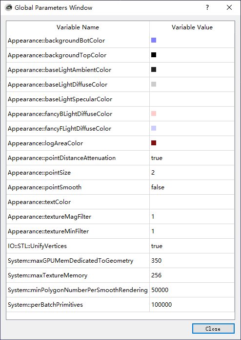

# GLArea Setting

一些显示参数，例如顶点显示的大小在此设置。

点击菜单“工具” -> “options" 后会出现相关设置界面:



类 GLAreaSetting 的定义位于 MeshLab/src/meshlab/glarea_setting.h 中。
在 MeshLab/src/meshlab/glarea.h ln147 的 GLArea 中则定义了其对象 GLAreaSetting glas。
这样我们可以通过 GLA ( ) 来访问此类参数的设置。

上面点击菜单“工具” -> “options" 的响应函数位于
MeshLab/src/meshlab/mainwindow_init.cpp 的 ln496：
```cpp
	setCustomizeAct = new QAction(tr("&Options..."), this);
	connect(setCustomizeAct, SIGNAL(triggered()), this, SLOT(setCustomize()));
```
槽函数的定义位于 
MeshLab/src/meshlab/mainwindow_RunTime.cpp 的 ln5771：
```cpp
void MainWindow::setCustomize()
{
    CustomDialog dialog(currentGlobalParams,defaultGlobalParams, this);
    connect(&dialog,SIGNAL(applyCustomSetting()),this,SLOT(updateCustomSettings()));
    dialog.exec();
}
```
在对话框 CustomDialog dialog 发出信号 applyCustomSetting() 后，
槽函数 updateCustomSettings ( ) 进行响应：
```cpp
void MainWindow::updateCustomSettings()
{
    mwsettings.updateGlobalParameterSet(currentGlobalParams);
    emit dispatchCustomSettings(currentGlobalParams);
}
```
这里完成了一些全局参数的设置，而对 glarea 参数的设置则通过信号 dispatchCustomSettings
继续传递给 GLArea 进行设置。

该信号 dispatchCustomSettings 与槽的连接位于 MeshLab/src/meshlab/glarea.cpp ln121：
```cpp
        connect(mainwindow,SIGNAL(dispatchCustomSettings(RichParameterSet&)),this,SLOT(updateCustomSettingValues(RichParameterSet&)));
```

在 MeshLab/src/meshlab/glarea.cpp ln1778 中对传来的信号 dispatchCustomSettings 
进行响应：
```cpp
void GLArea::updateCustomSettingValues( RichParameterSet& rps )
{
	makeCurrent();
    glas.updateGlobalParameterSet(rps);

    this->update();
}
```

