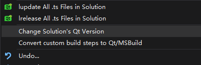

# Memoire of 3D Programming

<https://gitee.com/Wuhan3D/devMem>

<https://github.com/3D-Wuhan/devMem>

---------------------------------------------------

* For Qt coding tips, please go to [coding tips](qt.md)
* For meshlab codes review, please see [codes review](meshLab/meshlab.md)

## 1. Change Solution's Qt Version

Right click the name of the solution and ...

## 2. Is there an event loop for Qt applications?

<https://doc.qt.io/qt-5/qcoreapplication.html#details>

-------------------------------------------------------

The QCoreApplication class provides an event loop for Qt applications without UI. 
This class is used by non-GUI applications to provide their event loop. For non-GUI 
application that uses Qt, there should be exactly one QCoreApplication object. For 
GUI applications, see QGuiApplication. For applications that use the Qt Widgets 
module, see QApplication.

QCoreApplication contains the main event loop, where all events from the operating 
system (e.g., timer and network events) and other sources are processed and 
dispatched. It also handles the application's initialization and finalization, as 
well as system-wide and application-wide settings.

### 2.1 The Event Loop and Event Handling

The event loop is started with a call to exec(). Long-running operations can call 
processEvents() to keep the application responsive.

In general, we recommend that you create a QCoreApplication, QGuiApplication or a 
QApplication object in your main() function as early as possible. **exec( ) will not 
return until the event loop exits**; e.g., when quit() is called.

Several static convenience functions are also provided. The QCoreApplication object 
is available from instance(). Events can be sent with sendEvent() or posted to an 
event queue with postEvent(). Pending events can be removed with removePostedEvents() 
or dispatched with sendPostedEvents().

